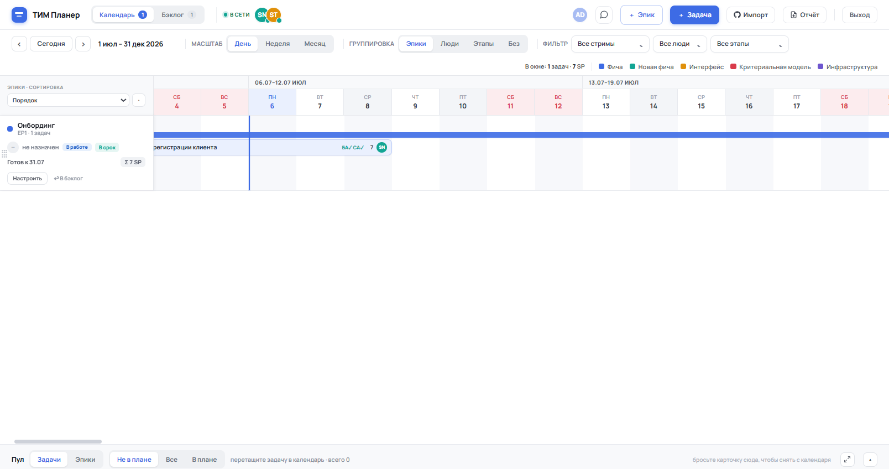
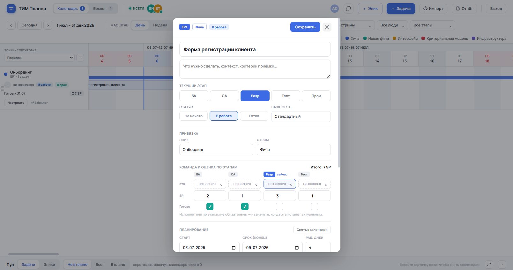

# ТИМ Планер

**Командная доска планирования** — эпики, задачи по этапам, Gantt-календарь по рабочим дням,
совместная работа в реальном времени, PDF-отчёты, опциональные интеграции (ИИ-агент в чате,
двусторонняя синхронизация с GitHub Issues, почтовые уведомления).

Одно самодостаточное приложение: **FastAPI** (бэкенд) + один HTML-файл SPA на рантайме
DCLogic (фронтенд). Данные — в **SQLite**. Зависимостей минимум, разворачивается за пару минут.

<p align="center">
  
  
</p>

---

## Содержание
- [Возможности](#возможности)
- [Как это устроено](#как-это-устроено)
- [Быстрый старт](#быстрый-старт)
  - [Вариант 1. Docker (рекомендуется)](#вариант-1--docker-рекомендуется)
  - [Вариант 2. Локально без Docker](#вариант-2--локально-без-docker)
- [Пользователи и роли](#пользователи-и-роли)
- [Конфигурация (.env)](#конфигурация-env)
- [Опциональные интеграции](#опциональные-интеграции)
- [Прод-развёртывание](#прод-развёртывание)
- [Структура проекта](#структура-проекта)
- [Модель данных](#модель-данных)
- [Резервное копирование](#резервное-копирование)
- [Разработка и правка фронтенда](#разработка-и-правка-фронтенда)
- [Диагностика](#диагностика)
- [Лицензия](#лицензия)

---

## Возможности

**Планирование**
- **Эпики → задачи**, декомпозиция по этапам: Бизнес-анализ, Системный анализ, Разработка, Тест, Пром.
- **Статус задачи** — три значения (Не начато / В работе / Готово), независимы от этапа.
- **Готовность по этапам** — чек-бокс на каждом этапе; выполненные этапы видны на календаре галочкой.
- **Стримы** (потоки): Фича, Новая фича, Интерфейс, Критериальная модель, Инфраструктура.
- **Важность** задачи, оценка в SP и исполнители — по каждому этапу.

**Календарь (Gantt по рабочим дням)**
- Масштабы День / Неделя / Месяц; выходные не считаются рабочими днями.
- Полоски задач с перетаскиванием и изменением длительности; дедлайн = конец дня.
- Группировка по эпикам / людям / этапам; ghost-задачи эпика; кнопка «Сегодня».

**Бэклог и пул**
- Разрезы по стримам / командам / спринтам; фильтр «Мои задачи»; пул нераспределённых задач.

**Совместная работа**
- Сервер — источник правды; клиенты шлют операции и опрашивают доску (~3с). Трёхстороннее слияние
  сохраняет ваши несинхронизированные правки. Присутствие «в сети» + время последнего захода.
- Командный чат; загрузка файлов-вложений к задачам (хранятся на сервере, доступны всем участникам).

**Отчёты (PDF, landscape)**
- **Спринт** — таблица: эпики → задачи с описанием, стрим/исполнитель/дедлайн/статус.
- **Месяц** — «колбаски» (Gantt по дням) с цветовой легендой и метками завершения эпиков;
  шапка с днями повторяется на каждой печатной странице.

**Опциональные интеграции** (по умолчанию выключены, включаются в `.env`)
- **ИИ-агент в чате** — напишите `@agent <вопрос>` — ответит по данным доски (любой OpenAI-совместимый API).
- **GitHub Issues** — импорт issues в пул; перевод задачи на «Разработку» → создание issue;
  закрытие issue на GitHub → задача уходит в «Готово» + этап «Пром».
- **Почта** — письма о смене статуса/этапа задач.

---

## Как это устроено

```
Браузер (SPA: frontend/index.html + dc-runtime.js)
   │  HTTP: /api/planner/*  (JSON)
   ▼
FastAPI (backend/web_app.py)
   ├─ авторизация: JWT в httpOnly-cookie (core/auth.py), пользователи в data/users.json
   ├─ раздача SPA под /planner/ с проверкой доступа
   └─ JSON-API планера (planner/planner_api.py)
        ├─ доска (rev + tasks + epics) в SQLite  (planner/db.py)
        ├─ вложения на диске                       (planner/files.py)
        ├─ GitHub-синхронизация (опц.)             (planner/github.py)
        ├─ ИИ-агент чата (опц.)                    (core/agent.py)
        └─ почтовые уведомления (опц.)             (planner/notify.py)
```

**Совместная доска.** Вся доска хранится одним снимком `{rev, tasks, epics}`. Клиент шлёт
операции (`task.upsert` / `epic.upsert` / `*.delete`) в `POST /api/planner/mutate`, сервер сливает
их, поднимает `rev` и возвращает актуальную доску; клиенты опрашивают `GET /api/planner/state`.
Мутации сериализуются процессным замком — поэтому **приложение запускается в один воркер**.

---

## Быстрый старт

Нужен либо **Docker**, либо **Python 3.10+**.

### Вариант 1 — Docker (рекомендуется)

```bash
git clone <URL-этого-репозитория> tim-planner
cd tim-planner
cp .env.example .env

# ОБЯЗАТЕЛЬНО задайте секрет в .env:
python -c "import secrets; print('PLANNER_SECRET=' + secrets.token_urlsafe(48))"   # вставьте в .env

docker compose up -d --build

# создать первого пользователя-администратора (внутри контейнера):
docker compose exec planner python scripts/make_user.py admin --password 'ВАШ_ПАРОЛЬ' --admin

# (опционально) демо-данные:
docker compose exec planner python scripts/seed_demo.py
```

Откройте **http://localhost:8000/** → войдите как `admin`. Готово.

### Вариант 2 — локально без Docker

```bash
git clone <URL-этого-репозитория> tim-planner
cd tim-planner

python -m venv .venv
# Linux/macOS:
source .venv/bin/activate
# Windows PowerShell:
# .venv\Scripts\Activate.ps1

pip install -r requirements.txt
cp .env.example .env      # и задайте PLANNER_SECRET

# первый пользователь:
python scripts/make_user.py admin --password 'ВАШ_ПАРОЛЬ' --admin
# (опц.) демо-данные:
python scripts/seed_demo.py

# запуск:
cd backend
uvicorn web_app:app --host 127.0.0.1 --port 8000 --workers 1
```

Либо одной командой: `./run.sh` (Linux/macOS) или `./run.ps1` (Windows).

Откройте **http://127.0.0.1:8000/**.

---

## Пользователи и роли

Пользователи хранятся в JSON-файле (`data/users.json`), пароли — хеш **PBKDF2** (секретов в коде нет).
Управление — скриптом `scripts/make_user.py`:

```bash
# админ (полный доступ)
python scripts/make_user.py admin  --password 'pass' --admin

# участник с доступом к Планеру и ролями
python scripts/make_user.py ivanov --password 'pass' --planner --roles ba,dev

# сменить пароль существующему
python scripts/make_user.py ivanov --password 'new-pass'
```

- `--admin` — `is_admin` (полный доступ, в т.ч. к Планеру).
- `--planner` — `planner_access` (доступ к Планеру без прав администратора).
- `--roles` — через запятую из набора: `ba, sa, dev, test, qa, po, pm, lead`
  (роли `ba/sa/dev/test` подставляются в «Ответственные по этапам»; `po`=Product Owner, `pm`=Product Manager
  и прочие — организационные метки).

Без флага `--planner`/`--admin` пользователь войдёт, но увидит страницу «Нет доступа к Планеру».

---

## Конфигурация (.env)

Все настройки — через переменные окружения (файл `.env`). Единственное **обязательное** в проде —
`PLANNER_SECRET`. Полный список с комментариями — в [`.env.example`](.env.example).

| Переменная | Назначение | По умолчанию |
|---|---|---|
| `PLANNER_SECRET` | Секрет подписи сессий (**задайте свой, ≥32 симв.**) | небезопасный дефолт |
| `PLANNER_DATA_DIR` | Каталог данных (БД, файлы, пользователи) | `./data` |
| `PLANNER_DB_PATH` | Путь к SQLite-БД | `data/planner.db` |
| `PLANNER_FILES_DIR` | Каталог вложений | `data/planner_files` |
| `PLANNER_USERS_FILE` | Файл пользователей | `data/users.json` |
| `PLANNER_FRONTEND_DIR` | Каталог SPA | `./frontend` |
| `PLANNER_COOKIE` | Имя cookie сессии | `planner_session` |
| `PLANNER_TOKEN_TTL_DAYS` | Срок жизни сессии, дней | `7` |
| `PLANNER_AGENT_API_URL/KEY/MODEL` | ИИ-агент чата (OpenAI-совместимый API) | выкл |
| `PLANNER_AGENT_CMD` | ИИ-агент как внешняя CLI-команда | выкл |
| `GITHUB_REPO`, `PLANNER_GITHUB_TOKEN` | GitHub-интеграция (`owner/repo` + токен) | выкл |
| `GITHUB_SYNC_ENABLED`, `GITHUB_SYNC_HOURS` | Фоновый авто-импорт issues | `1`, `3` |
| `PLANNER_NOTIFY_ENABLED`, `PLANNER_SMTP_*`, `PLANNER_NOTIFY_TO` | Почтовые уведомления | выкл |

---

## Опциональные интеграции

### ИИ-агент в чате (`@agent`)
В командном чате напишите `@agent <вопрос>` — агент ответит по данным доски. Включается заданием
в `.env` любого OpenAI-совместимого API:
```env
PLANNER_AGENT_API_URL=https://api.openai.com/v1/chat/completions
PLANNER_AGENT_API_KEY=sk-...
PLANNER_AGENT_MODEL=gpt-4o-mini
```
Либо своей CLI-командой (`PLANNER_AGENT_CMD`) — промпт приходит на stdin, ответ читается со stdout.
Без настройки `@agent` вежливо сообщит, что не подключён.

### GitHub Issues (двусторонняя синхронизация)
```env
GITHUB_REPO=owner/repo
PLANNER_GITHUB_TOKEN=ghp_xxx        # доступ к issues репозитория
```
- Кнопка **«Импорт»** и фоновый авто-импорт тянут открытые issues в пул как «неопределённые» задачи.
- Перевод задачи на этап **«Разработка»** создаёт issue (метка `team-planer`) и связывает его с задачей.
- **Закрытие issue** на GitHub переводит связанную задачу в статус «Готово» и на этап «Пром».
- Дедупликация по номеру issue; ручная сортировка задач сохраняется между синхронизациями.

### Почтовые уведомления
```env
PLANNER_NOTIFY_ENABLED=1
PLANNER_NOTIFY_TO=team@example.com
PLANNER_SMTP_HOST=smtp.example.com
PLANNER_SMTP_PORT=465
PLANNER_SMTP_USER=bot@example.com
PLANNER_SMTP_PASS=app-password
```
Письмо уходит при смене статуса/этапа задач (с анти-штормом).

---

## Прод-развёртывание

**Docker (проще всего):** см. [Быстрый старт](#вариант-1--docker-рекомендуется). Данные — в volume `planner_data`.

**systemd + nginx (без Docker):**
1. Разложите проект в `/opt/tim-planner`, создайте `.venv`, заполните `.env`, заведите пользователя ОС `planner`.
2. `sudo cp deploy/tim-planner.service /etc/systemd/system/` → отредактируйте пути/пользователя →
   `sudo systemctl daemon-reload && sudo systemctl enable --now tim-planner`.
3. TLS и проксирование — по образцу [`deploy/nginx.conf.example`](deploy/nginx.conf.example).

> ⚠️ Запускайте **строго один воркер** (`--workers 1`): присутствие и замок доски живут в памяти процесса.
> Масштабирование — вертикальное; для отказоустойчивости выносите SQLite на надёжный диск и делайте бэкапы.

---

## Структура проекта

```
tim-planner/
├─ backend/
│  ├─ web_app.py            # FastAPI: авторизация, вход/выход, раздача SPA, подключение API
│  ├─ config.py             # вся конфигурация из окружения (.env)
│  ├─ core/
│  │  ├─ auth.py            # PBKDF2-пароли + JWT-cookie + зависимость авторизации
│  │  ├─ users.py           # пользователи из data/users.json
│  │  └─ openclaw.py        # подключаемый ИИ-агент чата (API/CLI/выкл)
│  └─ planner/
│     ├─ planner_api.py     # JSON-API доски (state/mutate/people/chat/presence/upload/github-sync…)
│     ├─ db.py              # SQLite-слой (доска, чат, присутствие, история)
│     ├─ github.py          # GitHub Issues (импорт/создание/закрытие)
│     ├─ files.py           # хранилище вложений
│     ├─ notify.py          # почтовые уведомления (опц.)
│     └─ schema.sql
├─ frontend/
│  ├─ index.html            # SPA (доска, календарь, модалки, отчёты)
│  ├─ dc-runtime.js         # рантайм DCLogic (не редактируется вручную)
│  └─ fonts/                # Manrope (woff2)
├─ scripts/
│  ├─ make_user.py          # создать/обновить пользователя
│  └─ seed_demo.py          # демо-данные
├─ deploy/                  # systemd-юнит + пример nginx
├─ Dockerfile, docker-compose.yml
├─ requirements.txt, .env.example
└─ run.sh, run.ps1
```

---

## Модель данных

Доска — один снимок `{rev, tasks, epics}` (SQLite, строка `key='board'`). Ключевые поля:

- **Задача:** `id, title, description, epicId, streamId, stage(ba|sa|dev|test|prod),
  status(todo|doing|done), stageDone{<этап>:bool}, priority, assigneeId, est{ba,sa,dev,test},
  start, dur (рабочих дней), deadline, order, files[], comments[], activity[]`
  (+ при GitHub-связи: `ghNumber, ghUrl, ghState, source`).
- **Эпик:** `id, key, name, color, status, planned, start, due, order, leads{}`.

`dur` считается в **рабочих днях** (выходные исключены), инвариант «дедлайн = плановый конец».

---

## Резервное копирование

Всё состояние — в каталоге данных (`PLANNER_DATA_DIR`, по умолчанию `./data`):
`planner.db` (доска/чат/присутствие), `planner_files/` (вложения), `users.json` (доступы).

```bash
# горячий бэкап БД (безопасно при работающем сервере):
sqlite3 data/planner.db ".backup 'backup-$(date +%F).db'"
# либо просто заархивировать каталог data/ при остановленном сервисе
tar czf tim-planner-data-$(date +%F).tgz data/
```

---

## Разработка и правка фронтенда

Фронтенд — один файл `frontend/index.html` в формате **DCLogic** (`.dc.html`-подход): разметка с
`{{ }}`, `<sc-for>`, `<sc-if>` и класс-логика, исполняемые рантаймом `dc-runtime.js` (его править не нужно).
Правки видны после перезагрузки страницы (HTML отдаётся с `no-store`). Бэкенд можно запускать с
авто-перезагрузкой: `uvicorn web_app:app --reload`.

API самодокументирован FastAPI: **http://localhost:8000/docs**.

---

## Диагностика

- **`InsecureKeyLengthWarning`** при старте — короткий `PLANNER_SECRET`. Задайте ≥32 символов.
- **`@agent` не отвечает** — не заданы `PLANNER_AGENT_API_*`/`PLANNER_AGENT_CMD` (по умолчанию агент выключен).
- **Импорт из GitHub 503/502** — не задан `GITHUB_REPO`/`PLANNER_GITHUB_TOKEN` или у токена нет доступа к репозиторию.
- **«Нет доступа к Планеру»** — у пользователя нет `planner_access`/`is_admin` (см. `make_user.py`).
- **Здоровье API:** `GET /api/planner/health`.
- **Не запускайте несколько воркеров** — доска сериализуется в памяти одного процесса.

---

## Лицензия

[MIT](LICENSE).
